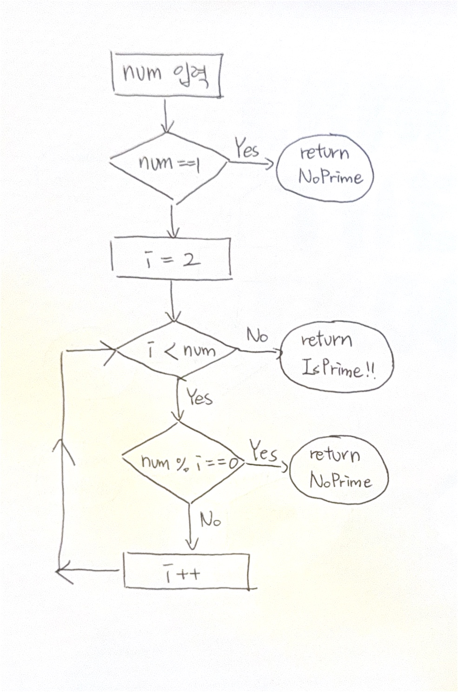

# 1. 자료구조를 정의하고 일상 생활의 비유를 들어 설명하세요

- 자료 구조란 데이터를 효율적으로 저장하고 관리하는 방식이다.

- 일상 생활에 비유하자면 물건을 정리하고 보관하는 방식이라 생각할 수 있다.

- 예를 들어 냉장고를 정리할 때 종류별로 모아 구역을 나누어 보관하면 찾기 쉽다는 점은 자료 구조에서 배열과 연관될 수 있고, 도서관에서 책을 정리하는 방법은 분류에 따라 정리된다는 점에서 자료구조의 트리 구조와 연관될 수 있다.

# 2. 알고리즘을 정의하고 일상 생활의 비유를 들어 설명하세요

- 알고리즘이란 컴퓨터로 문제를 풀기 위한 단계적인 절차이다.

- 알고리즘은 요리 레시피라고 할 수 있다.

- 예를 들어 라면을 끓일 때 재료들을 가지고 일련의 정해진 과정을 거쳐서 결과물이 나오게 하는 과정에 비유할 수 있다.

# 3. 자료 구조가 알고리즘에 미치는 영향에 대해 예를 들어 설명하시오

- 보통 자료 구조를 어떻게 사용하느냐에 따라 알고리즘의 성능이 크게 달라진다.

- 예를 들어 다항식 `x^100 + 1` 을 저장할 때, 배열을 사용하면 0부터 100까지의 차수를 모두 저장해야 하므로 불필요한 0이 많이 포함된다.  

- 하지만 구조체를 활용하여 차수와 계수만 저장하면 필요한 정보만 관리할 수 있어 공간 효율성이 증가하고, 연산 속도도 개선된다.

# 4. flow chart 그리기 : 자연수 n ( > 0) 이 주어졌을 때, 소수인지 판단하는 알고리즘의 flow chart를 그리세요

# 5. Abstract data type 정의를 정의하고 비유를 들어 설명하세요

- ADT는 데이터 타입을 추상적(수학적)으로 정의한 것이다. 데이터나 연산이 무엇인가는 정의되지만 데이터나 연산을 어떻게 컴퓨터 상에서 구현할 것인지는 정의되지 않는다.

- ADT의 정의는 추상 데이터 타입에 속하는 객체가 정의되고 이들 객체 사이의 연산이 정의된다.

- TV를 통해 비유하자면 사용자들은 TV의 내부에서 무엇이 일어나고 있는지 몰라도 조작할 수 있듯이 ADT는 데이터와 연산이 무엇인지만 정의한다.

# 6. 알고리즘의 O(1), O(n) 시간 복잡도의 의미를 설명하세요

- 시간복잡도는 입력크기 n에 대해 알고리즘이 수행하는 연산의 증가량을 분석하는 개념이다

- O(1)은 상수 시간으로 입력크기 (n)에 상관 없이 항상 일정한 시간 내에 실행되는 알고리즘을 말한다.

- O(n)은 선형 시간으로 입력크기 (n)이 커질수록 실행 시간이 비례해서 증가하는 알고리즘을 말한다.

# 7. Binary search 알고리즘의 시간 복잡도를 구하세요

- 이진 탐색은 탐색 시 매 단계 구역을 절반씩 줄여 나간다.

- 따라서 초기 입력의 길이를 n이라고 하면 그 크기가 n -> n/2 -> n/4 -> n/8 ->.... 식으로 감소한다.

- 탐색할 요소가 하나가 되는 경우를 수식으로 표현하면 `n / 2^k = 1`인 경우이다.

- `k = log_2(n)` 으로 나타낼 수 있다. (로그 2에 n)

- 따라서 시간복잡도는 **O(log n)** 이다.

# 8. 2n^2 + 3n + 7 회 수행되는 알고리즘의 시간 복잡도를 구하고, 그 이유를 설명하시오.

- 빅오 표기법에서 자료의 개수가 많은 경우 차수가 가장 큰 항이 가장 영향을 크게 미치고 다른 항들은 상대적으로 무시될 수 있기 때문에 `2n^2 + 3n + 7`의 경우에는 `2n^2`가 가장 큰 영향을 미친다.

- 따라서 시간복잡도는 **O(n^2)** 이다.